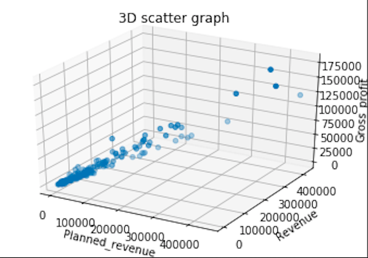

# 3D scatter graph

- python

- panda


### # raw data

### 


### #  code

```python
#!/usr/bin/env python3
# -*- coding: utf-8 -*-
"""
Created on Wed Oct 10 08:45:59 2018

@author: jin-tak.han
"""

import matplotlib.pyplot as plt
import numpy as np
from mpl_toolkits.mplot3d import Axes3D
import pandas as pd


df =  pd.read_csv('/Users/jin-tak.han/Code/Python_data_visualization/Scatter_graph_basic/data_sample_scatter.csv')
x = df["Planned_revenue"]
y = df["Revenue"]
z = df["Gross_profit"]

list_x = [] 
list_y = []
list_z = []

for i in range(0, 200):
    list_x.append(x[i])
    list_y.append(y[i])
    list_z.append(z[i])
    


fig = plt.figure()
ax1 = fig.add_subplot(111,projection='3d')

ax1.scatter(list_x,list_y,list_z)
plt.title("3D scatter graph")

ax1.set_xlabel('Planned_revenue')
ax1.set_ylabel('Revenue')
ax1.set_zlabel('Gross_profit')

plt.show()
```


### #  graph



