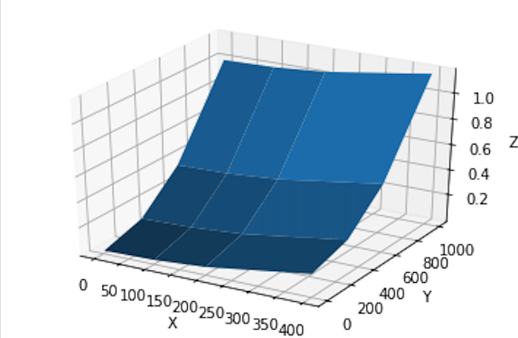

# 3D surface graph

- python
- pandas


### #  plot	



​	


### #  code

```python
import matplotlib.pyplot as plt
from mpl_toolkits.mplot3d import Axes3D
import numpy as np

# Create x, y coords
#nx, ny = 800, 1600
#cellsize = 1.
#x = np.arange(0., float(nx), 1.) * cellsize
#y = np.arange(0., float(ny), 1.) * cellsize

x = [1,100,200,400]
y = [1,300,600,1000]

X, Y = np.meshgrid(x, y)

# dummy data
Z = (X**2 + Y**2) / 1e6


# Create matplotlib Figure and Axes
fig = plt.figure()

ax = fig.add_subplot(111, projection='3d')

print (X.shape, Y.shape, Z.shape)

# Plot the surface
ax.plot_surface(X, Y, Z)

ax.set_xlabel('X')
ax.set_ylabel('Y')
ax.set_zlabel('Z')

plt.show()
```


