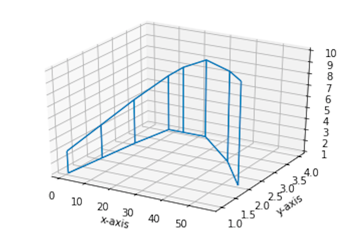

# 3D wireframe plot

- python
- pandas


### #  plot

<video controls>                                                                
    <source                                                                     
        src="wireframe_video.mov"
        type="video/mp4">                                                       
</video>


<video width="320" height="240" controls>
  <source src="wireframe_video.mov" type="video/mp4">
</video>


Video

<video src="wireframe_video.mov"></video>

here

### 


### #  code

```python
import matplotlib.pyplot as plt
from mpl_toolkits.mplot3d import axes3d
import numpy as np
import pandas as pd


#df =  pd.read_csv('/Users/jin-tak.han/Code/Python_data_visualization/Pie_graph_basic/data_sample_pie_chart.csv')
#revenue_data = df["Revenue"]


x = [1,3,5,8,14,23,42,56]
y = [1,2,3,4,4,4,3,2]

z = np.array([[1,1,1,1,1,1,1,1],[3,4,5,6,7,8,9,10]])

figure = plt.figure()
axis = figure.add_subplot(111, projection = '3d')

axis.plot_wireframe(x, y, z)

axis.set_xlabel('x-axis')
axis.set_ylabel('y-axis')
axis.set_zlabel('z-axis')

plt.show()
```


