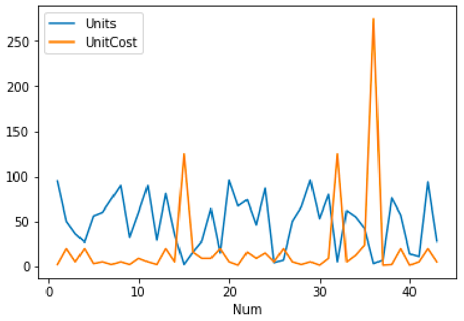

# Line graph basic

- python
- pandas


### #  graph

### 


### # raw data


### #  code

```python
import matplotlib as mpl
import numpy as np
import pandas as pd

 # https://www.shanelynn.ie/python-pandas-read_csv-load-data-from-csv-files/

data = pd.read_csv('/Users/jin-tak.han/Code/Python_data_visualization/Line_graph_basic/sample_data.csv')

data.set_index("Num", inplace= True)
data.head()

data.plot()
plt.show()
```


