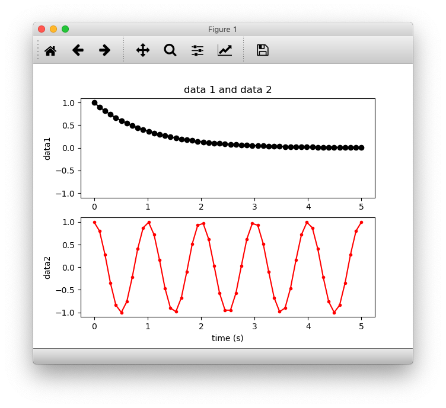

# Line sub plot

- python
- pandas
- NumPy


### #  plot




### #  code

```python
import numpy as np
import matplotlib.pyplot as plt


# Data for plotting
x1 = np.linspace(0.0, 5.0)
x2 = np.linspace(0.0, 5.0)


y1 = 1 * np.exp(-x1)
y2 = np.cos(2 * np.pi * x2)


# Create two subplots sharing y axis
fig, (ax1, ax2) = plt.subplots(2, sharey=True)

ax1.plot(x1, y1, 'ko-')
ax1.set(title='data 1 and data 2', ylabel='data1')

ax2.plot(x2, y2, 'r.-')
ax2.set(xlabel='time (s)', ylabel='data2')

plt.show()
```


