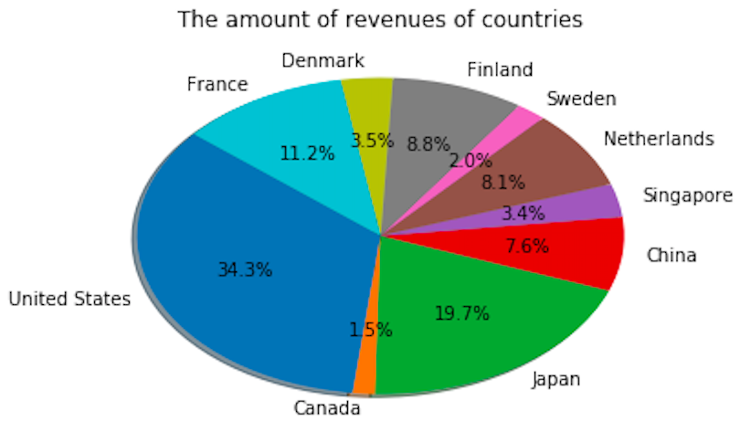

# Pie graph basic

- python
- panda


### # raw data


### # code

```python
import matplotlib.pyplot as plt
import pandas as pd

df =  pd.read_csv('/Users/jin-tak.han/Code/Python_data_visualization/Pie_graph_basic/data_sample_pie_chart.csv')

target = df["Retailer country"]
revenue_data = df["Revenue"]


#colors = ["#1f77b4", "#ff7f0e", "#2ca02c", "#d62728", "#8c564b"]
          
plt.pie(revenue_data, labels=target, autopct='%1.1f%%', shadow=True, startangle=140)
plt.title("The amount of revenues of countries")
plt.show()
```


### #  graph





