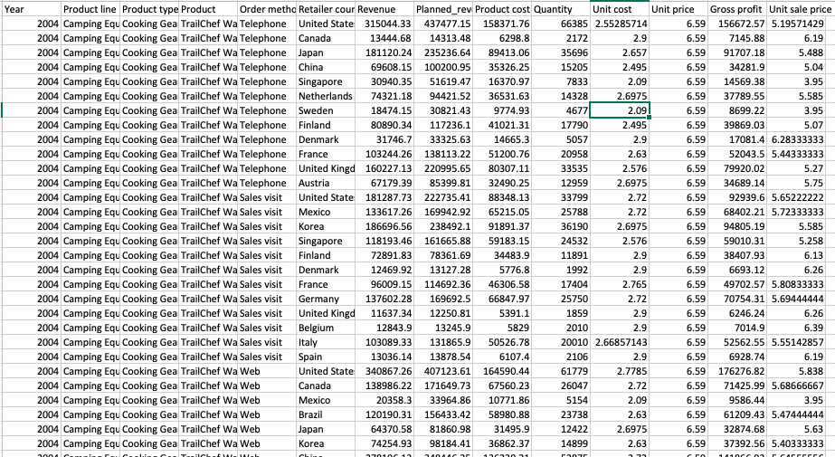

# Scatter graph basic

- python

- panda


### # raw data




### # code

```python
import matplotlib.pyplot as plt
import pandas as pd

df =  pd.read_csv('/Users/jin-tak.han/Code/Python_data_visualization/Scatter_graph_basic/data_sample_scatter.csv')

Planned_revenue = df["Planned_revenue"]
Revenue = df["Revenue"]


df.plot(kind='scatter',x='Planned_revenue',y='Revenue') # scatter plot

plt.title("Relevant between Planned revenue and Actual")
plt.show()
```


### #  graph


